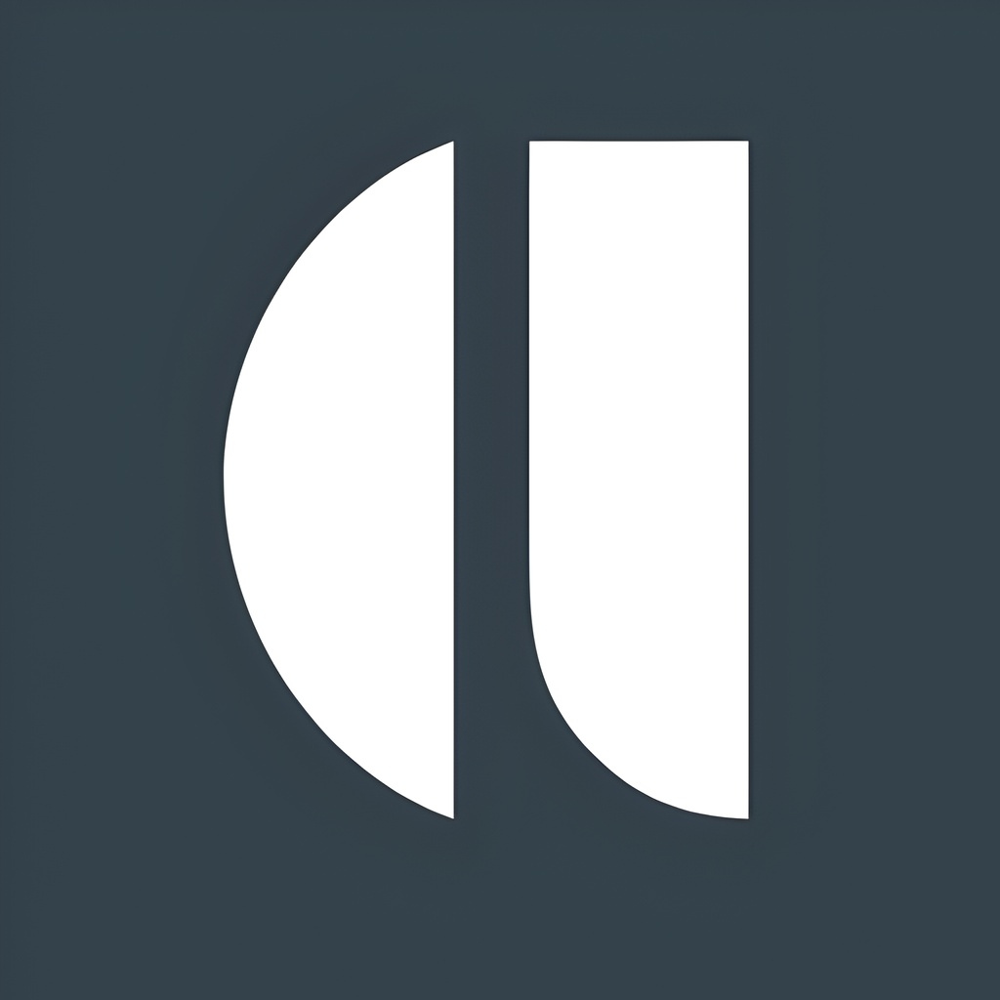
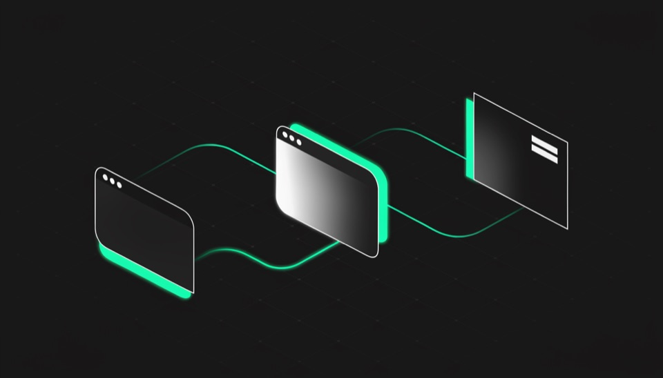
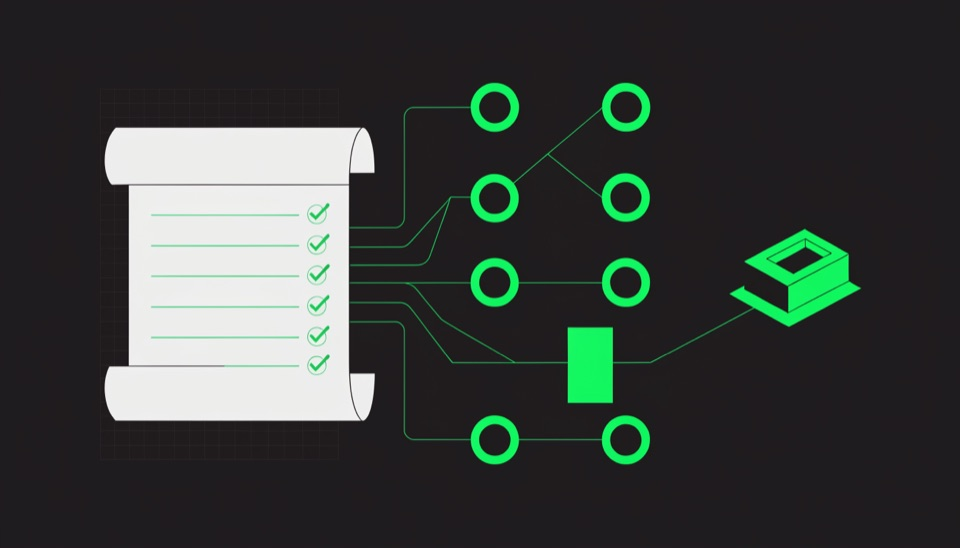
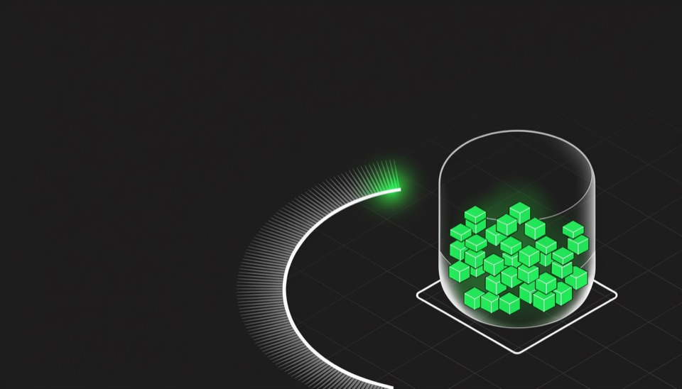

<div align="center">



# 9 עקרונות העבודה עם Claude Code

**סביבת קורס וידאו בעברית: מלאה, RTL, ורצה מקובץ אחד.**

[](#-הקישור-החי)
[](#)
[](#)
[](#רישיון)

  

</div>

---

## מה זה

סביבת למידה מבוססת וידאו שמלווה את סדרת הסרטונים על עבודה נכונה עם **Claude Code**, סוכן הקוד של Anthropic.
תשעה עקרונות, כל אחד בפרק משלו, ופרק סיכום. הקורס מיועד גם למי שמעולם לא כתב שורת קוד.

הכל רץ בצד הלקוח: אין שרת, אין שלב בנייה, אין תלויות. פותחים את `index.html` והקורס עובד.

## מה יש בפנים

| | |
|---|---|
| **נגן ייעודי** | סרגל זמן עם סימוני פרקי משנה, קפיצה 10 שניות, בקרת מהירות, כתוביות, תמונה-בתוך-תמונה, מסך מלא |
| **פרקי משנה** | כל סרטון מחולק לנושאים; לחיצה קופצת לרגע המדויק, והנושא הנוכחי מסומן תוך כדי צפייה |
| **סימניות** | `B` מסמן את הרגע הנוכחי, שומר איתו את המשפט שנאמר שם, ומציב סיכה על סרגל הזמן |
| **הערות** | פנקס לכל פרק, נשמר אוטומטית, עם כפתור שמכניס את חותמת הזמן הנוכחית |
| **תמלול** | תמלול מלא לכל פרק, ניתן לחיפוש, נגלל עם הסרטון ומאפשר קפיצה למשפט |
| **חומר קריאה** | ההסבר הכתוב המלא של אותו עיקרון, לקריאה בלי וידאו |
| **התקדמות** | המשך מאיפה שהפסקתם, אחוז נצפה לכל פרק, וסימון פרק כהושלם |

הכל נשמר ב-`localStorage` של הדפדפן. שום דבר לא נשלח לשום מקום.

## קיצורי מקלדת

| מקש | פעולה | | מקש | פעולה |
|---|---|---|---|---|
| `רווח` / `K` | נגן / השהה | | `M` | השתקה |
| `J` / `L` | 10 שניות אחורה / קדימה | | `C` | כתוביות |
| `←` `→` | 5 שניות | | `F` | מסך מלא |
| `↑` `↓` | עוצמת קול | | `B` | סימנייה ברגע הנוכחי |
| `P` / `N` | פרק משנה קודם / הבא | | `<` `>` | האטה / האצה |
| `0`-`9` | קפיצה ל-0% עד 90% | | `?` | רשימת הקיצורים |

## הפעלה מקומית

```bash
python3 -m http.server 8000
```

ואז `http://localhost:8000`. אפשר גם פשוט לפתוח את `index.html` בדפדפן. הכל עובד גם מ-`file://`, כולל הגופנים (הם מקומיים).

## מבנה

```
index.html            סביבת הקורס
principles.html       המדריך הכתוב המלא, המקור לחומר הקריאה שבתוך הפרקים
assets/
  course.css          כל העיצוב
  course.js           כל הלוגיקה (וניל, בלי תלויות)
  fonts/              Noto Sans Hebrew + JetBrains Mono, מקומיים
data/
  course.js           מבנה הקורס: פרקים, פרקי משנה, קישורי וידאו
  transcripts.js      תמלולים (נוצר מ-whisper.cpp)
  reading.js          חומר הקריאה (נוצר מ-principles.html)
imgs/thumbs/          תמונות הפרקים
web-media/            הווידאו (720p, מותאם לאינטרנט)
```

## הוספת פרק

1. שימו את הווידאו ב-`web-media/chN.mp4`.
2. ב-`data/course.js`, הוסיפו לפרק `video`, `duration`, `poster` ורשימת `markers` (זמן וכותרת לכל נושא).
3. אם יש תמלול, הוסיפו את המערך תחת `N` ב-`data/transcripts.js` בפורמט `{s, e, t}`: שנייה התחלה, שנייה סיום, טקסט.

הפרקים שאין להם `video` מוצגים אוטומטית כ"בהפקה", עם חומר הקריאה שלהם כבר זמין.

## עיצוב

הפלטה, הגופנים והרקע (הזוהר הירוק ורשת הקווים הנעה) לקוחים ישירות ממערכת העיצוב של
[הבלוג של אבי לוי](https://www.avilevi.co.il): `#1b1b1b` על `#22C55E`, Noto Sans Hebrew,
ו-`GridBackground` בהמרה מדויקת. הדף כולו RTL עם מאפיינים לוגיים, ואין בו גלילה אופקית בשום רוחב.

## רישיון

התוכן (הווידאו, התמלולים והטקסטים) הוא של אבי לוי, לשימוש אישי של הלומדים.
הקוד של סביבת הקורס חופשי לשימוש.

---

<div align="center">

**אבי לוי** · [הבלוג](https://www.avilevi.co.il) · [ערוץ היוטיוב](https://www.youtube.com/channel/UCdz7iR7sYg2gevHXEyeeM1Q)

</div>
